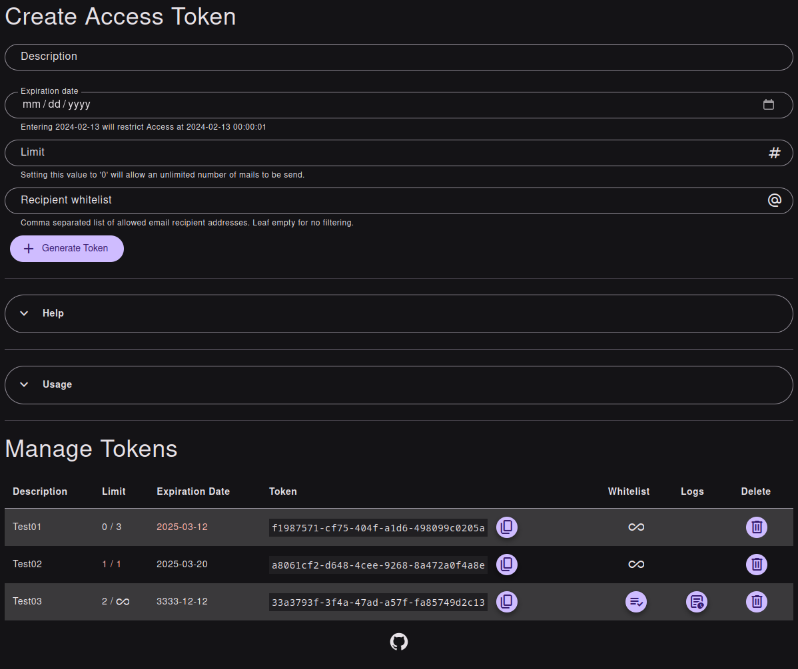

# CuckooPost

CuckooPost is a simple self-hosted PHP-based email sending service that supports both SMTP and PHP's `mail()` function. It includes token-based authentication and allows you to manage tokens via an admin interface.

## Why should I use CuckooPost

CuckooPost provides a secure and straightforward way to send emails without the need to store your mail credentials in scripts that could be accessed by third parties. By using token-based authentication, you can ensure that your email sending credentials remain secure and are not exposed in your codebase.

You also have not to rely on third-party libraries because most coding languages and scripting environments allow posting some data to an API endpoint.

## Features

- Send emails using SMTP or PHP's `mail()` function.
- Token-based authentication for secure email sending.
- Admin interface to manage tokens.
- Debugging support with error emails.
- Optional logging of all send messages.
- Recipient whitelist.

## Requirements

- PHP 8.3 or higher
- Composer for dependency management
- SQLite3 extension enabled

## Installation

1. Clone the repository:

    ```sh
    git clone https://github.com/soulflyman/CuckooPost.git
    cd CuckooPost
    ```

2. Install dependencies using Composer:

    ```sh
    composer install
    ```

3. Copy the example base configuration file and adjust it to your needs:

    ```sh
    cp admin/base_config.php.example admin/base_config.php
    ```

4. You absolutely should passwordprotect the admin folder.

## Configuration

### Base Configuration

Edit `admin/base_config.php` to set the sender email address and name:

```php
$cuckooPostBaseConfig = [
    'from' => 'your_sender_address',
    'fromName' => 'CuckooPost',
    'mailLog' => false,
];
```

The `from` address should be a valid and existing mailbox or forwarder to on, because in the case of an error CuckooPost does sned an error message to this email address.

### SMTP Configuration

Edit `admin/smtp_config.php` to set your SMTP server details:

```php
$smtpConfig = [
    'host' => 'smtp.example.com',
    'username' => 'your_username',
    'password' => 'your_password',
    'port' => 587
];
```

### SMTP vs `mail()`

CuckooPost does use the php `mail()` function when the file `smtp_config.php` does not exist. Using SMTP is highly recomended, because `mail()` does relate on `sendmail` on most systems. But sending mails with `sendmail` is reason enough for most mail servers to flag the email as spam.

CuckooPost always does use the `mail()` function when sending error emails to you.

## Usage

In some server configurations you have to add `index.php` to the url or when using `curl` just add the option `-L`

### Sending Emails

To send an email, make a POST request to the endpoint with the required parameters and an authorization token.

#### Example using cURL

```sh
curl -X POST "https://example.com/CuckooPost" \
    -H "Authorization: Bearer YOUR_TOKEN" \
    -d "mailto=someone@example.com" \
    -d "subject=Hello" \
    -d "message=Test%20message"
```

### Admin Interface

Access the admin interface to manage tokens at `https://example.com/admin/`.

**CuckooPost does not provide any access protection for the admin panel. So it is highly recommended that you restrict access to the admin folder based on your server setup like using an .htaccess on Apache or limit the access only from specific IPs in your firewall.**

## Screenshots



## License

This project is licensed under the MIT License. See the [LICENSE](LICENSE) file for details.

## Development

The software was a quick and dirty solution that solved an acute problem I had and is by far not the prettiest under the hood. For my purpose, this application is nearly feature complete. If there are critical issues and I have some spare time, then I will fix them. However, pull requests are welcome.
